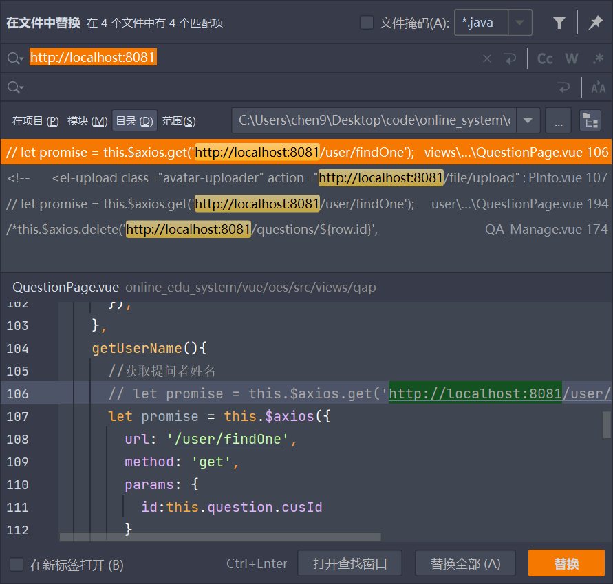
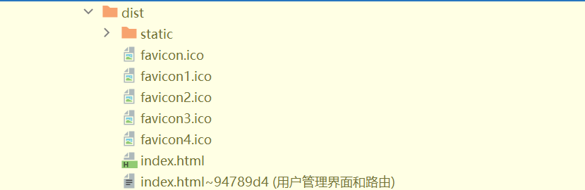
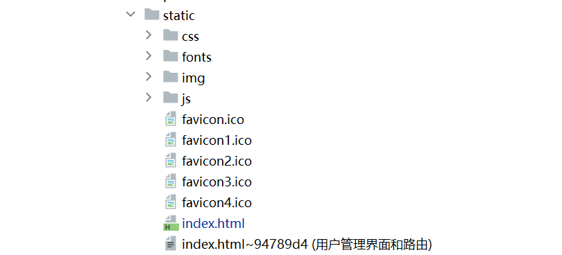
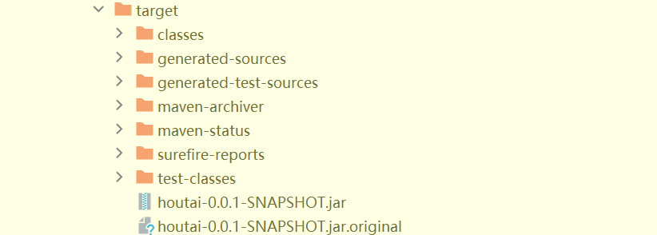
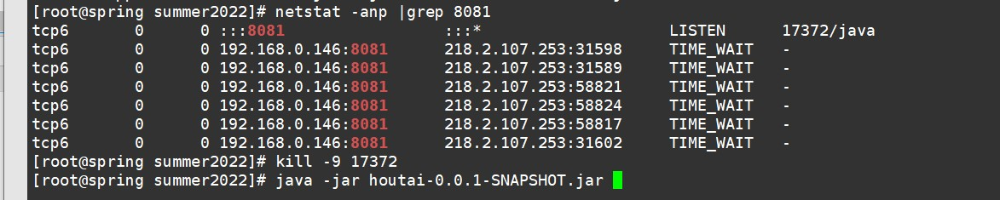

# online_edu_system
2022暑期学校java_web实训项目

相关名词： 
1. springboot
2. vue
3. mybatisPlus
4. elementUI

相关软件：

1. IntelliJ IDEA2022.1
2. WebStorm2022.2
3. DataGrip2022.1.5
4. VS Code
5. Navicat 15
6. Swagger UI
7. Postman
8. ApiFox
9. Xshell
10. Xftp
11. 石墨文档
12. jetbrains.space
13. Visio
14. GitHub
---
## 项目部署

### 1.配置

#### 1.1前端配置

1. 将vue.config.js添加publicPath代码语句

```javascript
  publicPath: './', // 部署应用包时的基本 url
```

2. 在main.js中将

```javascript
axios.defaults.baseURL = 'http://loaclhost:8081';
修改为
axios.defaults.baseURL = 'http://120.46.178.233:8081';
```

3. 将.vue界面中的所有

```javascript
url:'http://loaclhost:8081/questions';
改为
url:'/questions';
```
>在此处有一个技巧，使用对应根目录下：右键，然后“在文件中替换”
输入对应的文件内容，将修改的内容输入替换并使用即可


#### 1.2后端配置

1. 在properties中添加

```java
spring.mvc.static-path-pattern=/static/**
```

2. 在properties中将数据库连接改为服务器的云端数据库，并传入对应的数据

```javascript
spring.datasource.druid.url=jdbc:mysql://120.46.178.233:3306/edu_system?serverTimezone=GMT%2b8&useUnicode=true&useSSL=false&characterEncoding=utf8

```

3. 在pom.xml文件中添加对应的依赖

```java
<dependency>
    <groupId>org.springframework.boot</groupId>
    <artifactId>spring-boot-starter-thymeleaf</artifactId>
</dependency>  
```

### 2.打包

#### 2.1前端打包

1. 在前端代码的根目录中运行

```javascript
npm run build
```

2. 生成对应的dist文件夹



#### 2.2后端打包

1. 将生成的前端生成的dist目录中的内容，放置到对应的后端resources目录下的static目录下

2. 使用Intellij IDEA的maven打包功能依次执行

    1. clean
    2. compile
    3. package

   完成打包，得到target目录下的houtai-0.0.1.jar文件


### 3.部署

1. 通过Xshell和Xftp工具连接到对应的服务器，然后将houtai-0.0.1-SNAPSHOT.jar文件放到对应的目录下
2. 运行对应指令

```javascript
nohup java -jar houtai-0.0.1-SNAPSHOT.jar
```
### 意外情况
需要先关闭对应的端口号，然后再去将执行对应的指令

---

